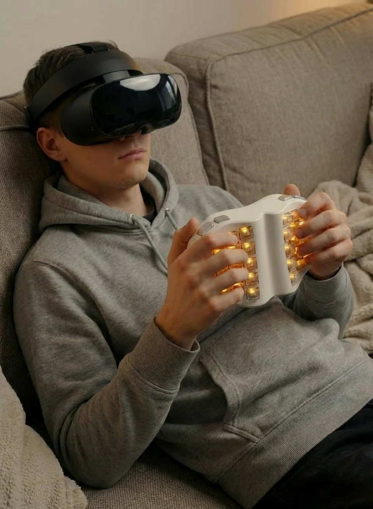

# Accordy-Keyboard

**Portable Professional Full-Finger Input Solution for AR/VR**

**AR/VR 便携专业全指输入端方案**

---

---

## English

### Overview

Accordy-Keyboard is an innovative input solution designed for AR/VR environments. By leveraging front-projection technology in AR/VR headsets, we solve two critical challenges:

1. **Invisible Keyboard Problem** - Users cannot see their physical keyboard while wearing VR headsets
2. **Mode Switching Difficulty** - Non-full-keyboard solutions require complex mode switching for professional input

### Key Features

- **Full-Finger Input** - Supports all 10 fingers for professional typing speed
- **AR/VR Front Projection** - Virtual keyboard overlay visible through headset
- **Portable Design** - Compact form factor for mobile productivity
- **Professional Grade** - Designed for developers, writers, and power users

### Vision

We aim to bridge the gap between immersive AR/VR experiences and professional productivity by providing a seamless, full-featured input solution that doesn't compromise on typing efficiency.

---

## 中文

### 概述

Accordy-Keyboard 是一款专为 AR/VR 环境设计的创新输入方案。通过利用 AR/VR 头显的正面投影技术，我们解决了两个关键难题：

1. **键盘不可见问题** - 用户佩戴 VR 头显时无法看到物理键盘
2. **模式切换困难** - 非全键盘方案需要复杂的模式切换才能实现专业输入

### 核心特性

- **全指输入** - 支持十指输入，达到专业打字速度
- **AR/VR 正面投影** - 虚拟键盘叠加层通过头显可见
- **便携设计** - 紧凑外形，适合移动办公
- **专业级别** - 专为开发者、写作者和高级用户设计

### 愿景

我们致力于弥合沉浸式 AR/VR 体验与专业生产力之间的鸿沟，提供无缝、全功能的输入方案，不牺牲打字效率。

---

## Collaboration / 合作招募

Developers, designers, or hardware engineers interested in this project are welcome to contact us via GitHub Issues.

对该项目有兴趣的开发者、设计师或硬件工程师，欢迎通过 GitHub Issues 联系。

---

## License / 许可证

**All Rights Reserved / 保留所有权利**

See [LICENSE](LICENSE) for details. / 详见 [LICENSE](LICENSE) 文件。

Copyright (c) 2024 Accordy-Keyboard. All rights reserved.
